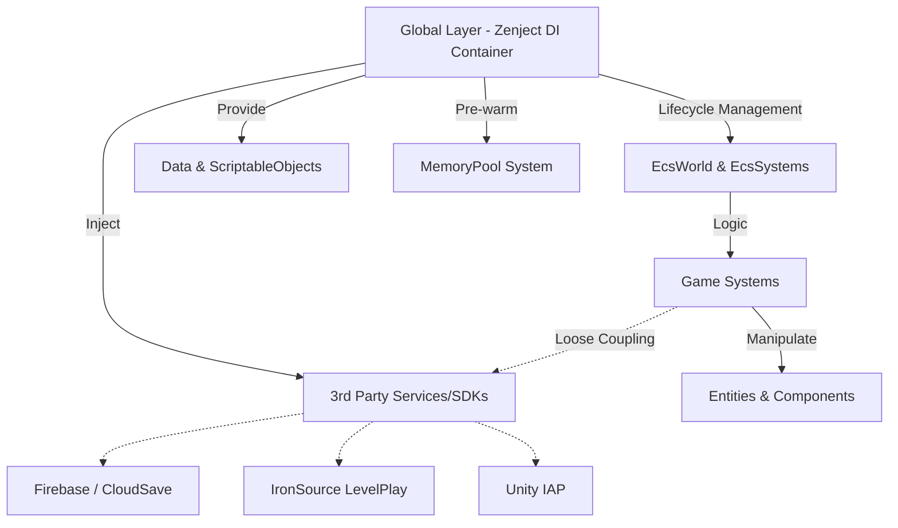
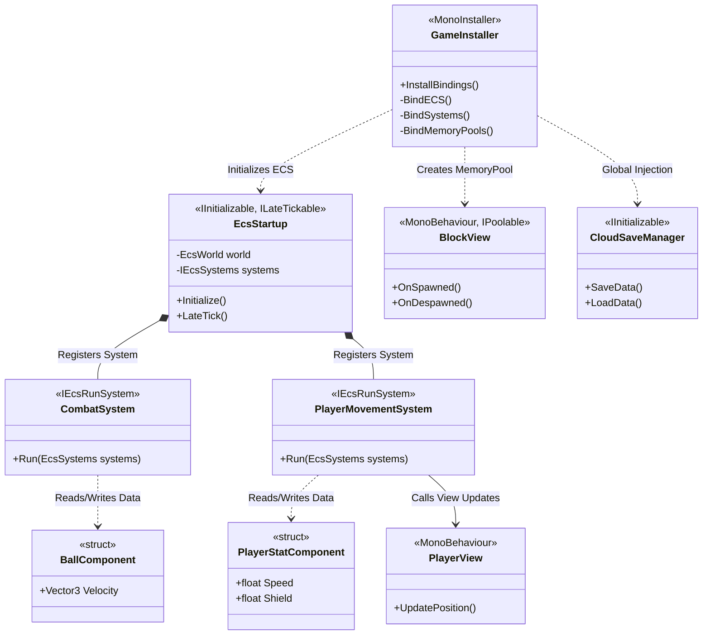

# 🚀 ARCHITECTURE CASE STUDY: CURVE DASH - SOLVING PERFORMANCE BOTTLENECKS IN MOBILE GAMES

*(Portfolio Document tailored for Senior Unity Engineer / Lead Developer roles)*

---

> [!NOTE] 
> **PROJECT OBJECTIVE**
> Curve Dash is not just another endless-runner game. For me, it served as a "laboratory" to solve one of Unity's most persistent problems: **Maintaining a rock-solid 60 FPS on low-end Android devices while completely eliminating Garbage Collector (GC) stutter.**

## 1. 🏗️ THE ARCHITECTURE

Instead of tightly coupling Logic and View (GameObjects) in the traditional MonoBehaviour style, I decided to completely decouple the Data layer and the Presentation (View) layer by combining **Leopotam EcsLite (ECS)** and **Zenject (Dependency Injection)**.



### Why EcsLite + Zenject?
- **EcsLite:** Processes thousands of Entities without generating a single byte of GC allocation during the Update loop (Zero-allocation game loop).
- **Zenject:** Enforces SOLID principles. Manages Global Services and automatically injects them into the necessary systems.

> [!TIP]
> **Architecture Snippet (GameInstaller):**
> I configured ECS directly inside the DI Container, making ECS an integral part of the strict initialization flow:
> ```csharp
> Container.BindInstance(new EcsWorld());
> Container.BindInterfacesAndSelfTo<EcsSystems>().AsSingle();
> Container.BindInterfacesTo<EcsStartup>().AsSingle();
> ```

### 🧬 Class Structure
To better visualize the Separation of Concerns, below is the core class diagram illustrating the connection between DI, ECS, and MonoBehaviours:


*This diagram clearly demonstrates the separation: Logic lives entirely in `Systems`, Data in `Components` (structs), and Presentation in `Views`. Everything is automatically glued together by `GameInstaller` (Zenject).*

---

## 2. ⚔️ ENGINEERING PROBLEMS SOLVED

### 🛑 Problem 1: Object Instantiation Bottleneck
In fast-paced games, continuously calling `Instantiate` and `Destroy` for terrain blocks, monsters, or VFX will kill CPU performance.

> [!IMPORTANT]
> **Solution: Dedicated Zenject MemoryPools**
> All game entities are *pre-warmed* (instantiated upfront) during the loading screen and stored in Pools, moving the computational heavy lifting entirely out of the main game loop.

```csharp
// Strictly managed via MemoryPool instead of Instantiate
Container.BindMemoryPool<BlockView, BlockViewPool>()
    .WithInitialSize(30).FromComponentInNewPrefab(...)
Container.BindMemoryPool<MonsterView, MonsterViewPool>()
    .WithInitialSize(10).FromComponentInNewPrefab(...)
```

### 🛑 Problem 2: Event Hell and Memory Leaks
Using traditional C# events (`Action`, `delegate`) extensively can easily lead to memory leaks if one forgets to unregister (`-=`).

👉 **Solution: Event as Component** 
I implemented an "Event as Component" pattern via `DeleteEventsSystem<T>`. The system attaches an event component (e.g., `PlayerHitCrystalEvent`) to an Entity. At the end of the frame, a generic system automatically cleans up all these event components.
```csharp
// Automatically sweeps and cleans events every late-frame, generating 0 GC
Container.BindInterfacesTo<DeleteEventsSystem<PlayerHitCrystalEvent>>().AsSingle();
Container.BindInterfacesTo<DeleteEventsSystem<PlayerHitObstacleEvent>>().AsSingle();
```

### 🛑 Problem 3: Integrating Heavy SDKs Without Polluting the Codebase
The game integrates Firebase, IronSource, Unity IAP, and Devion Inventory. Shoving these directly into Game Logic would result in spaghetti code.

👉 **Solution: Interface Adapters**
SDKs are wrapped inside standalone Services (`CloudSaveManager`, `LevelPlayAdService`) and injected into Systems via Interfaces. The Systems do not need to know how the underlying SDK operates.

---

## 3. 📊 PERFORMANCE & ARCHITECTURE COMPARISON

| Criteria | Traditional MonoBehaviour Approach | ECS + Zenject Approach (Curve Dash) |
| :--- | :--- | :--- |
| **Architecture Model** | Tightly Coupled | **Loosely Coupled** |
| **Garbage Collection** | Generates GC continuously every frame | **Zero-Allocation (0 bytes/frame Update)** |
| **Object Creation** | Runtime `Instantiate`/`Destroy` | **`Zenject MemoryPool` (Pre-warmed)** |
| **Scalability** | "Spaghetti" code as project grows | **Easily add/remove Systems & Services** |
| **Asset Loading** | Bulk loading from `Resources` | **Asynchronous `Addressables` Loading** |

---

## 🎯 THE TAKEAWAY

> [!WARNING]
> *I don't write code for computers to understand; I design systems for other engineers to read, maintain, and scale for the next 5 years.*

**Curve Dash** proves my ability to architect a product from A to Z:
1. **Data-Oriented Design** over blind Object-Oriented Design.
2. **Absolute Memory Control** for Mobile Devices.
3. **Designed for Scalability**, not just designed to "make it work for now".

*(💡 Hint: You can attach a short 3-5 second GIF showing Gameplay or the Unity Profiler demonstrating 0 bytes GC/frame right below this section to make it absolutely convincing!)*
