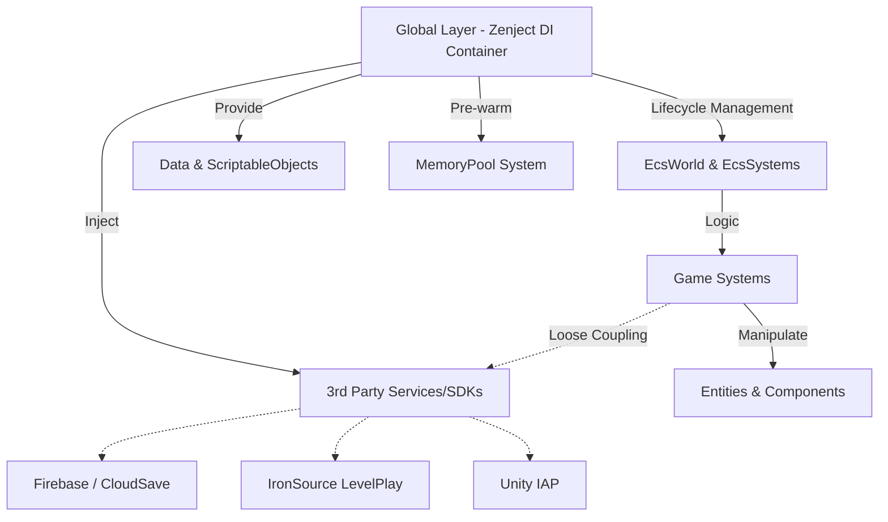
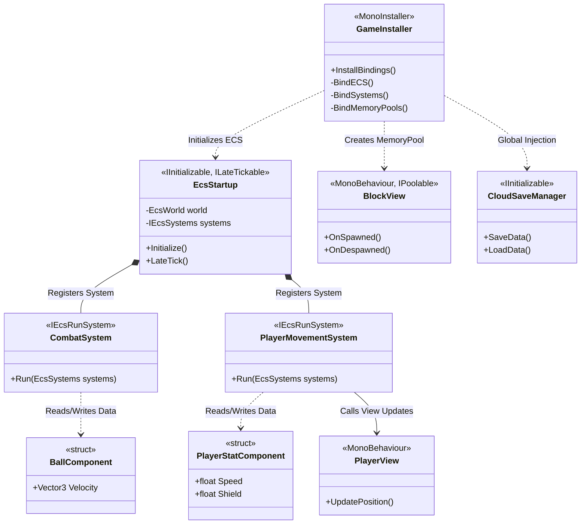

# 🚀 ARCHITECTURE CASE STUDY: CURVE DASH - SOLVING PERFORMANCE BOTTLENECKS IN MOBILE GAMES

*(Portfolio Document tailored for Senior Unity Engineer / Lead Developer roles)*

---

> [!NOTE] 
> **PROJECT OBJECTIVE**
> Curve Dash is not just another endless-runner game. For me, it served as a "laboratory" to solve one of Unity's most persistent problems: **Maintaining a rock-solid 60 FPS on low-end Android devices while completely eliminating Garbage Collector (GC) stutter.**

## 1. 🏗️ THE ARCHITECTURE

Instead of tightly coupling Logic and View (GameObjects) in the traditional MonoBehaviour style, I decided to completely decouple the Data layer and the Presentation (View) layer by combining **Leopotam EcsLite (ECS)** and **Zenject (Dependency Injection)**.



### Why EcsLite + Zenject?
- **EcsLite:** Processes thousands of Entities without generating a single byte of GC allocation during the Update loop (Zero-allocation game loop).
- **Zenject:** Enforces SOLID principles. Manages Global Services and automatically injects them into the necessary systems.

> [!TIP]
> **Architecture Snippet (GameInstaller):**
> I configured ECS directly inside the DI Container, making ECS an integral part of the strict initialization flow:
> ```csharp
> Container.BindInstance(new EcsWorld());
> Container.BindInterfacesAndSelfTo<EcsSystems>().AsSingle();
> Container.BindInterfacesTo<EcsStartup>().AsSingle();
> ```

### 🧬 Class Structure
To better visualize the Separation of Concerns, below is the core class diagram illustrating the connection between DI, ECS, and MonoBehaviours:


*This diagram clearly demonstrates the separation: Logic lives entirely in `Systems`, Data in `Components` (structs), and Presentation in `Views`. Everything is automatically glued together by `GameInstaller` (Zenject).*

---

## 2. ⚔️ ENGINEERING PROBLEMS SOLVED

### 🛑 Problem 1: Object Instantiation Bottleneck
In fast-paced games, continuously calling `Instantiate` and `Destroy` for terrain blocks, monsters, or VFX will kill CPU performance.

> [!IMPORTANT]
> **Solution: Dedicated Zenject MemoryPools**
> All game entities are *pre-warmed* (instantiated upfront) during the loading screen and stored in Pools, moving the computational heavy lifting entirely out of the main game loop.

```csharp
// Strictly managed via MemoryPool instead of Instantiate
Container.BindMemoryPool<BlockView, BlockViewPool>()
    .WithInitialSize(30).FromComponentInNewPrefab(...)
Container.BindMemoryPool<MonsterView, MonsterViewPool>()
    .WithInitialSize(10).FromComponentInNewPrefab(...)
```

### 🛑 Problem 2: Event Hell and Memory Leaks
Using traditional C# events (`Action`, `delegate`) extensively can easily lead to memory leaks if one forgets to unregister (`-=`).

👉 **Solution: Event as Component** 
I implemented an "Event as Component" pattern via `DeleteEventsSystem<T>`. The system attaches an event component (e.g., `PlayerHitCrystalEvent`) to an Entity. At the end of the frame, a generic system automatically cleans up all these event components.
```csharp
// Automatically sweeps and cleans events every late-frame, generating 0 GC
Container.BindInterfacesTo<DeleteEventsSystem<PlayerHitCrystalEvent>>().AsSingle();
Container.BindInterfacesTo<DeleteEventsSystem<PlayerHitObstacleEvent>>().AsSingle();
```

### 🛑 Problem 3: Integrating Heavy SDKs Without Polluting the Codebase
The game integrates Firebase, IronSource, Unity IAP, and Devion Inventory. Shoving these directly into Game Logic would result in spaghetti code.

👉 **Solution: Interface Adapters**
SDKs are wrapped inside standalone Services (`CloudSaveManager`, `LevelPlayAdService`) and injected into Systems via Interfaces. The Systems do not need to know how the underlying SDK operates.

---

## 3. 📊 PERFORMANCE & ARCHITECTURE COMPARISON

| Criteria | Traditional MonoBehaviour Approach | ECS + Zenject Approach (Curve Dash) |
| :--- | :--- | :--- |
| **Architecture Model** | Tightly Coupled | **Loosely Coupled** |
| **Garbage Collection** | Generates GC continuously every frame | **Zero-Allocation (0 bytes/frame Update)** |
| **Object Creation** | Runtime `Instantiate`/`Destroy` | **`Zenject MemoryPool` (Pre-warmed)** |
| **Scalability** | "Spaghetti" code as project grows | **Easily add/remove Systems & Services** |
| **Asset Loading** | Bulk loading from `Resources` | **Asynchronous `Addressables` Loading** |

---

## 4. 🛠️ CUSTOM TOOLING & PIPELINES (The Tech Lead Mindset)

A true Senior/Lead Engineer doesn't just write game logic; they build tools that multiply the entire team's productivity. In Curve Dash, I developed several advanced Custom Editor tools from scratch to streamline the workflow for Game Designers:

- **Master RPG Studio Window:** A comprehensive, centralized custom window (`MasterRPGStudioWindow.cs` - 42KB) that acts as the control panel for all game balancing and data management.
- **Skill Constellation Editor:** A visual node-based editor (`CurveDashSkillConstellationWindow.cs`) built with Unity's Editor tools to allow designers to create and balance complex skill trees intuitively without touching code.
- **Inventory & Item Inspectors:** Custom inspectors (`CurveDashInventoryEditorUtility.cs`, `WeaponDataInspector.cs`) that validate data integrity in real-time, preventing designers from entering invalid stats or breaking the game.

> [!NOTE]
> By investing time in these custom workflows, I eliminated data-entry errors, drastically reduced iteration time, and empowered the design team to tweak the game without engineering support.

---

## 🧩 BONUS CASE STUDY: TETRIS 3D - MASTERING ALGORITHMS & MVC

If Curve Dash demonstrates my ability to squeeze every drop of performance using Data-Oriented Design (ECS), **Tetris 3D** showcases my mastery over **Object-Oriented Programming (OOP), Clean Code, and Complex Algorithms**.

<div align="center">
  <a href="https://youtu.be/549IfNUVOz0?si=VKSjAYIHSceJCdJw">
    
  </a>
  <br>
  <em>(Click the image above to watch the Tetris 3D gameplay demonstration)</em>
</div>
<br>

> [!NOTE]
> **WHY THIS MATTERS**
> Tetris 3D is a highly algorithmic game requiring 3D matrix manipulation, ghost block projection, and strict game state flows. Applying ECS here would be overkill; instead, I implemented a robust **Model-View-Controller (MVC)** architecture driven by **Zenject Signals** and a **Finite State Machine (FSM)**.

### 1. The MVC + Event-Driven Architecture
I strictly separated the business logic from the Unity presentation layer:
- **Models:** Hold the 3D grid data, current piece shape, and score.
- **Views:** Only responsible for rendering Unity GameObjects (blocks) and playing VFX/Audio. They are completely dumb and hold no logic.
- **Controllers:** Process input, manipulate the Model, and broadcast events.

Instead of tight coupling, Controllers and Views communicate purely via **Zenject Signals** (Event-Driven Architecture).
```csharp
// Example: The Controller broadcasts a signal, and the View listens and updates itself.
_signalBus.Fire(new LinesClearedSignal(clearedLinesCount));
```

### 2. Finite State Machine (FSM)
Managing states (MainMenu -> Playing -> Paused -> GameOver) using `if/else` flags is a nightmare. I implemented a robust FSM to handle state transitions cleanly, ensuring that game logic (like block falling) immediately halts when the state changes to `Paused`.

### 3. Algorithmic Heavy-Lifting
- **3D Matrix Rotations:** Implementing mathematical rotations for 3D blocks without relying on Unity's physics engine.
- **Ghost Block Projection:** Using real-time matrix simulations to accurately project where the 3D block will land, completely decoupled from the actual falling block's state.

---

## 🎯 THE TAKEAWAY

> [!WARNING]
> *I don't write code for computers to understand; I design systems for other engineers to read, maintain, and scale for the next 5 years.*

Between **Curve Dash** and **Tetris 3D**, I have proven my versatility as a Senior Engineer:
1. **Performance & Data-Oriented Design (ECS)** when scalability and CPU efficiency are paramount.
2. **Clean Architecture (MVC & Event-Driven OOP)** when complex algorithmic business logic dictates the game flow.
3. **Custom Editor Tooling** to accelerate team pipelines and eliminate designer bottlenecks.
4. **Absolute Control** over the codebase across entirely different architectural paradigms.
